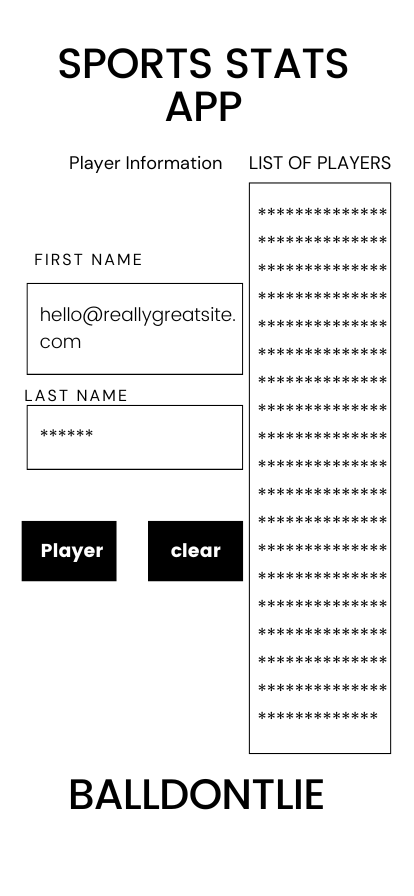

# Project Title

A dynamic website with user interaction and data from an external API

## Project Description

My project will require user interaction capturing inputted data. The data inputted will use BALLDONTLIE API to fetch a nba player from the api and display his measurements. The APi only fetches 25 players in the nba alphabetically. I will provide a list of players that the api uses so that we can test the api.

## Screenshots

## Roadmap

[x] Create README for project

[x] Work on how you want the project to be visualize

[x] Upload the visualization into README screenshots

[x] Work on html to bring the vision to life

[x] Start working on the interaction bringing the project to life

[x] Add style and format to the project with bootstrap

## Features

- Users can enter one of the players provided from the list that is provided and get some data about the player

- Balldontlie Web API

- The page will provide information about the player like height, position, and etc..

- Creates a play list of the songs that are played

- Bootstrap will be use to help with the layout of the project

## Acknowledgements

- [Awesome Readme Templates](https://awesomeopensource.com/project/elangosundar/awesome-README-templates)

- <https://www.archbee.com/blog/readme-document-elements>

- <https://www.canva.com/design/DAGFc4GXtaU/Dy3LSUZq3-_9FXG39EPsuA/edit>

- <https://docs.balldontlie.io/#get-all-players>

- <https://www.w3schools.com/js/tryit.asp?filename=tryjs_api_fetch>

- <https://web.postman.co/workspace/My-Workspace~bd184f46-88b7-4da7-89c3-d6766b7fb07c/request/16312574-d2702866-17d4-48a2-8a26-f9cc7e40a1af?tab=params>

- <https://getbootstrap.com>

- <https://thechrisgreen.com/2018/09/how-do-i-duplicate-a-line-within-visual-studio-code/>

## Author

- Louis Perkins

## License

[MIT](https://choosealicense.com/licenses/mit/)
